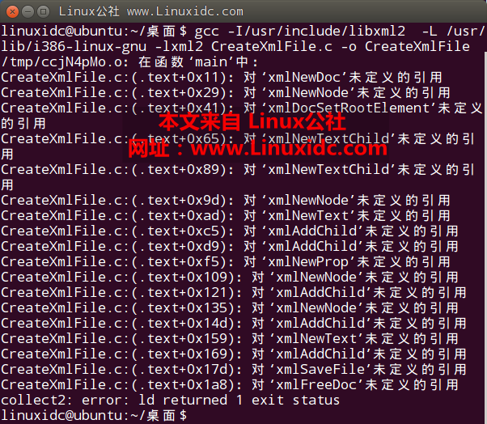

# The use of libxml2
   2017年12月22日 星期五：
   dpkg -L libxml2-dev 查看libxml头文件和链接库所在位置
对C源文件编译命令：
gcc -I/usr/include/libxml2 CreateXmlFile.c -o CreateXmlFile -L /usr/lib/i386-linux-gnu -lxml2
      其中，-I参数是为了指定gcc编译器查找头文件的路径，-L参数是为了指定libxml2库文件所在的路径，最后的-lxml2指定具体的库文件。（-lxml2一定要放在命令的最后位置，不然会出现找不到链接库的错误，如下图所示）
 
编程示例：
1、创建xml

	#include<stdio.h>
	#include<libxml/parser.h>
	#include<libxml/tree.h>

	int main(int argc, char **argv){
		 //Define document pointer
		 xmlDocPtr doc = xmlNewDoc(BAD_CAST"1.0");
		    //Define node pointer
		 xmlNodePtr root_node = xmlNewNode(NULL,BAD_CAST"root");
		 //Set the root element of the document
		 xmlDocSetRootElement(doc,root_node);
		 //Create child nodes directly in the root node
		 xmlNewTextChild(root_node,NULL,BAD_CAST"newnode1",BAD_CAST"newnode1 content");
		 xmlNewTextChild(root_node,NULL,BAD_CAST"newnode2",BAD_CAST"newnode2 content");
		 //Create a new node
		 xmlNodePtr node = xmlNewNode(NULL,BAD_CAST"node2");
		 //Create a new text node
		 xmlNodePtr content = xmlNewText(BAD_CAST"NODE CONTENT");
		 //Add a new node to parent
		 xmlAddChild(root_node,node);
		 xmlAddChild(node,content);
		 //Create a new property carried by a node
		 xmlNewProp(node,BAD_CAST"attribute",BAD_CAST"yes");
		 //Create a son and grandson node element
		 node = xmlNewNode(NULL,BAD_CAST"son");
		 xmlAddChild(root_node,node);
		 xmlNodePtr grandson = xmlNewNode(NULL,BAD_CAST"grandson");
		 xmlAddChild(node,grandson);
		 xmlAddChild(grandson,xmlNewText(BAD_CAST"THis is a grandson node"));
		 //Dump an XML document to a file
		 int nRel = xmlSaveFile("CreatedXml.xml",doc);
		 if(nRel != -1)
		  printf("一个xml文档被创建，写入 %d 个字节\n",nRel);
		 //Free up all the structures used by a document,tree included
		 xmlFreeDoc(doc);
		 //printf("Hello World!\n");
		 return 0;
	}
结果：

	<?xml version="1.0"?> 
	<root><newnode1>newnode1 content</newnode1><newnode2>newnode2 content</newnode2><node2 attribute="yes">NODE CONTENT</node2><son><grandson>THis is a grandson node</grandson></son></root>
2、解析xml

	#include <stdio.h>
	#include <stdlib.h>
	#include <libxml/parser.h>
	#include <libxml/tree.h>

	int main (int argc , char **argv)
	{
	xmlDocPtr pdoc = NULL;
	xmlNodePtr proot = NULL, pcur = NULL;
	/*****************打开xml文档********************/
	xmlKeepBlanksDefault(0);//必须加上，防止程序把元素前后的空白文本符号当作一个node
	pdoc = xmlReadFile ("test.xml", "UTF-8", XML_PARSE_RECOVER);//libxml只能解析UTF-8格式数据

	if (pdoc == NULL)        //检查是否打开正确
	{
	printf ("error:can't open file!\n");
	exit (1);
	}

	/*****************获取xml文档对象的根节对象********************/
	proot = xmlDocGetRootElement (pdoc);

	if (proot == NULL)
	{
	printf("error: file is empty!\n");
	exit (1);
	}

	/*****************查找书店中所有书籍的名称********************/
	pcur = proot->xmlChildrenNode;

	while (pcur != NULL)
	{
	//如同标准C中的char类型一样，xmlChar也有动态内存分配，字符串操作等 相关函数。例如xmlMalloc是动态分配内存的函数；xmlFree是配套的释放内存函数；xmlStrcmp是字符串比较函数等。
	//对于char* ch="book", xmlChar* xch=BAD_CAST(ch)或者xmlChar* xch=(const xmlChar *)(ch)
	//对于xmlChar* xch=BAD_CAST("book")，char* ch=(char *)(xch)
	if (!xmlStrcmp(pcur->name, BAD_CAST("book")))
	{
	xmlNodePtr nptr=pcur->xmlChildrenNode;
	while (pcur != NULL)
	{
	if (!xmlStrcmp(nptr->name, BAD_CAST("title")))
	{
	printf("title: %s\n",((char*)XML_GET_CONTENT(nptr->xmlChildrenNode)));
	break;
	}
	}

	}
	pcur = pcur->next;
	}

	/*****************释放资源********************/
	xmlFreeDoc (pdoc);
	xmlCleanupParser ();
	xmlMemoryDump ();
	return 0;
	}